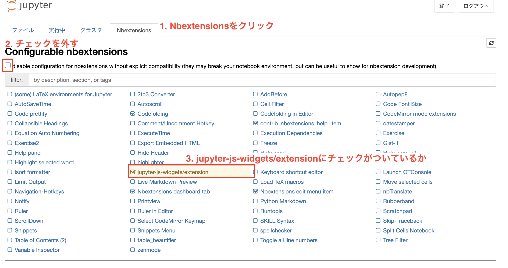

### 拡張機能をインストールする

```bash
pip install jupyter_contrib_nbextensions
```

### 拡張機能の設定を有効化する

```bash
jupyter contrib nbextension install --user
jupyter nbextension enable codefolding/main
```

### Jupternotebook起動

1. 上部タブから、`Nbextensions`をクリック
2. チェックを外す
3. jupyter-js-widgets/extensionsにチェックがついているか確認する  

    