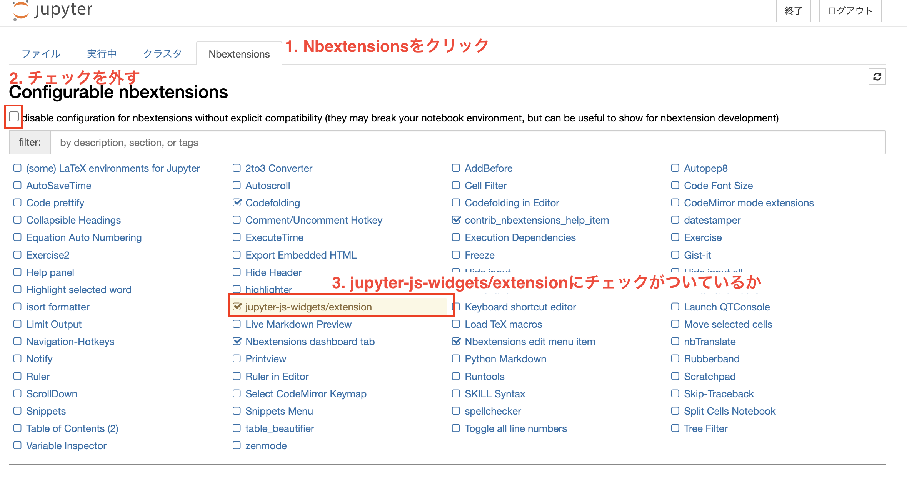

# Jupyter Notebook幅拡張機能を有効化する

### 仮想環境を有効化する

```bash
$ . .(仮想環境)/bin/activate

# 実行例
$ . .venv/bin/activate
```

### 拡張機能をインストールする

```bash
pip install jupyter_contrib_nbextensions
```

### 拡張機能の設定を実行する

```bash
jupyter contrib nbextension install --user
jupyter nbextension enable codefolding/main
```

実行結果

```bash
かなり長いので割愛
```

### Jupternotebook起動

1. 上部タブから、`Nbextensions`をクリック
2. チェックを外す
3. jupyter-js-widgets/extensionsにチェックがついているか確認する  

    

### 以下の拡張機能を有効化する

* ExecuteTime
* Hide input all
* Scratchpad
* table_beautifier 
* Variable Inspector
* Table of contents(2)
* Live Markdown Preview

## 参考文献

* https://gri.jp/media/entry/2850