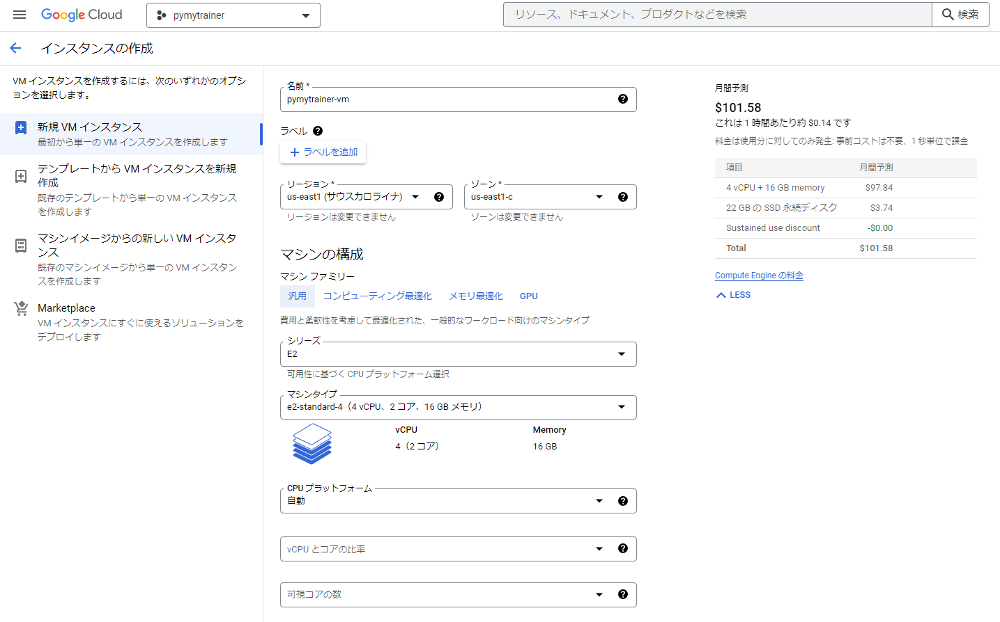
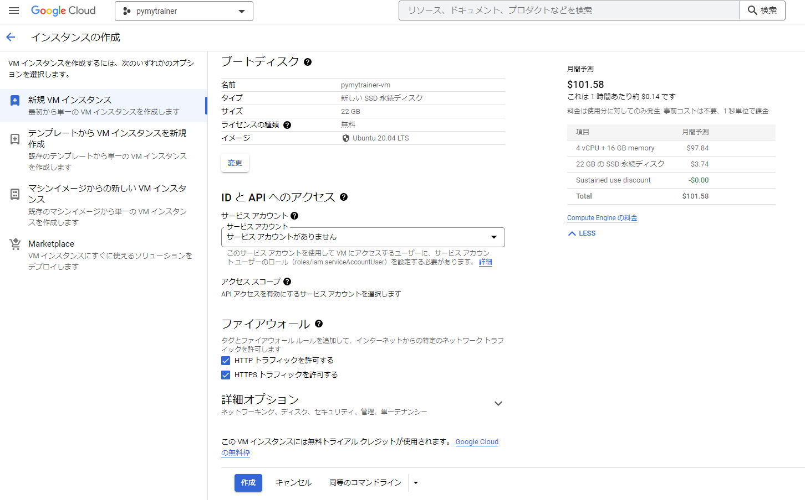

# JupyterHubを用いた受講者にPython環境を提供する

## JupyterHub

JupyterHubは、複数のユーザーに `JupyterNotebook` を提供するためのベストな方法です。例えば、学生クラス、企業のデータサイエンスチーム、科学研究グループなど。

> 参考:
> [JupyterHubについて - jupyterhub.readthedocs.io](https://jupyterhub.readthedocs.io/en/stable/)

これは、シングルユーザーのJupyterNotebook サーバーの複数インスタンスを生成、管理、およびプロキシするマルチユーザーハブです。

少数のユーザー(0~100)と単一サーバーの単純なケースが必要なケースの場合、[The Littlest JupyterHub](https://jupyterhub.readthedocs.io/en/stable/)を参考にする。

もし、それ以上に多くのユーザーを許可する場合は、動的な量のサーバーをクラウドで用意します。その場合、[Zero to JupyterHub with Kubernetes](https://github.com/jupyterhub/zero-to-jupyterhub-k8s)


## Google Cloud 上にJupyterHubをインストールする

### 前提条件

* Google Cloud Platformにアクセスできる状態にしておく  
  [Google Cloud Platform](https://console.cloud.google.com/freetrial?hl=ja)

### 目標

管理者を含む何人かのユーザーを含むJupyterHub環境をセットアップする。

### Step1: JupyterHub環境をComputeEngineに構築する

* 左上隅にある3本線のボタンをクリックして、ナビゲーションメニューを開きます。
* **[Compute Engine]** から、**[VMインスタンス]** を選択します。  
  

* 支払いの設定画面が出てきたら、その画面にしたがって、**[Enable billing]**をクリックしてください。

### Step2: インスタンスの詳細を設定する

変更した項目のみ記載

| 項目 | 項目説明 | 設定値 |
| :--- | :------ | :---- |
| Name | VMインスタンスの名前 | pymytrainer-vm |
| リージョン | VMインスタンスのリージョン | us-east1(サウスカロライナ) |
| ゾーン     | VMインスタンスのゾーン    | us-east1-c                |
| マシン構成 シリーズ | CPUタイプのシリーズ | E2                      |
| マシンタイプ       | 詳細構成            | e2-standard-4(4vCPU, 2コア, 16GBメモリ) |
| CPUプラットフォーム | -                 | 自動                     |
| ブートディスク OS | ブートディスクのOSファミリ  | Ubuntu             |
| バージョン        | ブートディスクのOSバージョン | Ubuntu20.04 LTS   |
| ブートディスクの種類 | ディスクタイプ           | SSD永続ディスク　　 |
| ディスクサイズ      | ディスクのサイズ          | 22GB              |
| ファイアウォール    | -                       | 以下の項目をチェック<br>HTTPトラフィックを許可<br>HTTPSトラフィックを許可 |

* IDとAPIへのサービスアカウントを **サービスアカウントがありません** に変更する
* 理由は、セキュリティ向上のため  
  
* 一点だけ自動化スクリプトを追加する
  **[詳細オプション]** >> **[管理]** >> **[自動化]** へ移動し自動化スクリプトを追加する
  ```bash
    #!/bin/bash
    curl -L https://tljh.jupyter.org/bootstrap.py \
    | sudo python3 - \
        --admin <admin-user-name>
  ```
  必ず、`<admin-user-name>` を変更する。

* 最後に、VMを作成ボタンを実行する

### 独自ドメインの割り当て

> 以下のサイトを参考にする  
> https://tljh.jupyter.org/en/latest/howto/admin/https.html

1. GoogleDomainでドメインを購入する。
2. 購入したDomainをGloud DNSと連携
3. IPアドレスとDomainを割り当てたのち、IPアドレスのまま、JupyterHubにアクセスする。
4. JupyterHubの端末から、以下のコマンドを実行する
   
   ```bash
   $ sudo tljh-config set https.enabled true
   $ sudo tljh-config set https.letsencrypt.email yasonomazon75@gmail.com
   $ sudo tljh-config add-item https.letsencrypt.domains pytrainerscmp.app
   $ sudo tljh-config reload
   $ sudo tljh-config show
   $ sudo tljh-config reload proxy
   ```
